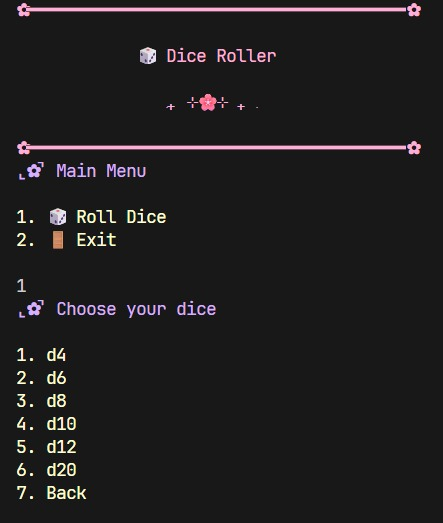
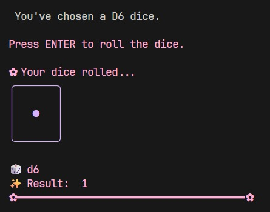
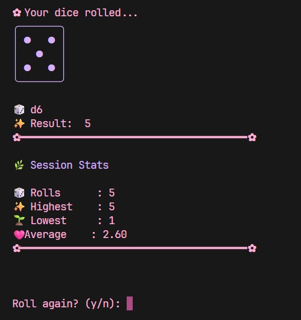

<div align="center">

<h1>🌸 BloomCode Readme Template 🌸</h1>

<p><em>🌸 Structure to follow when creating a project. 🌸</em></p>

</div>

---

<div align="center">

# ⌞📎⌝ Dice Roller

### ݁₊ ⊹🌸⊹ ₊ ݁ 
*• Modern C++ • BloomCode*

*Cozy terminal dice rolling application using C++.*

Part of the **🌸 BloomCode** collection.

</div>

---
<p align="center">

| ✿                |                   |
|:-----------------|:-------------------|
| **Language**     | C++23              |
| **Build System** | CMake              |           
| **Platform**     | Linux / WSL        |
| **Difficulty**   | ⭐ Beginner        |
| **Status**       | ✅ Complete (v1.0) |

</div>
---

# 🌸 About

Dice Roller is a cozy terminal application written in modern C++ that simulates
rolling different tabletop dice.

The project was created as a beginner-friendly exercise to practice the
fundamentals of C++ while building a pretty and polished console application.

During development I focused on writing modular code, separating the user
interface from the game logic, handling user input safely, and improving the
overall user experience with colors, ASCII art and clean menus.

---
## 🎨 Color Palette

<p align="center">

| Role    | Color                                                                                                             |
|---------|-------------------------------------------------------------------------------------------------------------------|
| Header  | <span style="display:inline-block;width:20px;height:20px;background:#FF9FCF;border-radius:4px;"></span> `#FF9FCF` |
| Menus   | <span style="display:inline-block;width:20px;height:20px;background:#C8A2FF;border-radius:4px;"></span> `#C8A2FF` |
| Success | <span style="display:inline-block;width:20px;height:20px;background:#A8E6CF;border-radius:4px;"></span> `#A8E6CF` |
| Options | <span style="display:inline-block;width:20px;height:20px;background:#FFF6E5;border-radius:4px;"></span> `#FFF6E5` |

</div>

## 🌻 Concepts Practiced

- Functions and modular programming
- Header and source file separation
- Random number generation (`<random>`)
- Input validation
- Loops and control flow
- Switch statements
- ANSI terminal colors
- ASCII art
- Session statistics
- CMake project structure

---

## ⌞📃⌝ Features

- 🎲 Roll D4, D6, D8, D10, D12 and D20 dice
- 🌸 Colorful terminal interface
- 🎲 ASCII dice representation for D6
- 🌸 Live session statistics
- 🎲 Roll multiple times without restarting
- 🌸 Input validation
- 🎲 Clear terminal between menus
- 🌸 Rolling animation

---

<p align="center">

## ⌞📸⌝ Previews

### Main Menu



### Dice Selection



### Rolling Result



</p>

---

## ⌞⚙️⌝ Build

### Requirements

- C++23
- CMake 3.20+
- Git

### Clone

```bash
git clone https://github.com/LuciaYSeApago/cpp-dice-roller.git
```

### Build

```bash
mkdir build
cd build

cmake ..

cmake --build .
```

### Run

```bash
./DiceRoller
```

---

## ⌞📖⌝ Project Structure

```text
project-name/
│
├── assets/
├── include/
├── screenshots/
├── src/
│
├── CMakeLists.txt
├── README.md
└── LICENSE
```

---

## ⌞🚀⌝ Future Ideas

- [ ] Multiple dice
- [ ] Different dice (D4, D8, D10...)
- [ ] Roll history
- [ ] Statistics
- [ ] Colored terminal output

---

## 🌸 BloomCode Philosophy

This project follows the BloomCode Design System.

- 🌸 Cozy
- 💖 Cute
- ✨ Clean
- 🌱 Growth
- 🎮 Playful
- 💻 Modern C++

Every project shares the same folder structure, documentation style, visual language and coding philosophy to create a cohesive learning collection.

---

## 📄 License

Released under the MIT License.